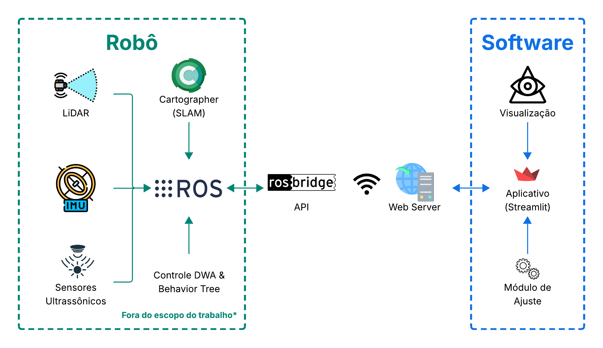

<div align="center">

# Interface de Controle e Telemetria para Robô Autônomo

**Trabalho de Conclusão de Curso em Engenharia de Computação**  
Universidade do Oeste de Santa Catarina (Unoesc) · Campus de Joaçaba


</div>

Aplicação web para acompanhar dados de um robô autônomo e enviar comandos por meio do ROS 2 e do rosbridge. O projeto faz parte do TCC **“Interface Gráfica Integrada ao ROS para Telemetria e Parametrização de Robô Autônomo”**.

<p align="center">
  
</p>

## Recursos

- Visualização do mapa de ocupação recebido em `/map` e da pose do robô.
- Leitura de velocidade linear e angular em `/cmd_vel`.
- Seleção de waypoint diretamente no mapa e publicação em `/goal_pose`.
- Controle manual do robô pela interface, com comandos de velocidade enviados em `/cmd_vel`.
- Atualização periódica da visualização e configuração do endereço do rosbridge pela barra lateral.

## Requisitos

- Python 3.10 ou superior.
- ROS 2 configurado com o pacote `rosbridge_server` disponível na máquina do robô ou na máquina de simulação.
- A aplicação e o rosbridge devem conseguir se comunicar pela rede, normalmente pela porta `9090`.

## Executar

Crie um ambiente virtual e instale as dependências:

```powershell
python -m venv .venv
.\.venv\Scripts\Activate.ps1
python -m pip install -r requirements.txt
```

No Linux, a ativação do ambiente é:

```bash
source .venv/bin/activate
```

Para habilitar a seleção de waypoints clicando no mapa, instale também o componente opcional:

```bash
python -m pip install streamlit-image-coordinates
```

Inicie o rosbridge no ambiente ROS 2:

```bash
ros2 launch rosbridge_server rosbridge_websocket_launch.xml address:=0.0.0.0 port:=9090
```

Execute a aplicação a partir da raiz do projeto:

```bash
python -m streamlit run src/views/main.py
```

Na barra lateral, informe o endereço IP da máquina que executa o rosbridge e a porta correspondente. A porta padrão é `9090`; a conexão deve estar acessível antes de usar os controles do robô.

## Estrutura

```text
src/
  handlers/   Comunicação ROS, processamento e operações auxiliares
  views/      Interface Streamlit
assets/       Imagens utilizadas pela aplicação
docs/tcc/     PDF e fontes LaTeX do trabalho
```

## TCC

- [Abrir o documento final em PDF](docs/tcc/main.pdf)
- [Consultar o fonte principal em LaTeX](docs/tcc/main.tex)

O diretório `docs/tcc/` inclui as seções, figuras, bibliografia e classe da Unoesc necessárias para manter os fontes do documento junto ao projeto.

## Testes e diagnóstico

Os scripts `test_pose_connect.py` e `test_tf_sub.py` são utilitários de diagnóstico da conexão e dos tópicos ROS. Eles precisam de um rosbridge acessível para funcionar e não são testes automatizados isolados.

## Autor

**Rafael Corrêa Zart**  
Orientador: **Kleyton Hoffmann**